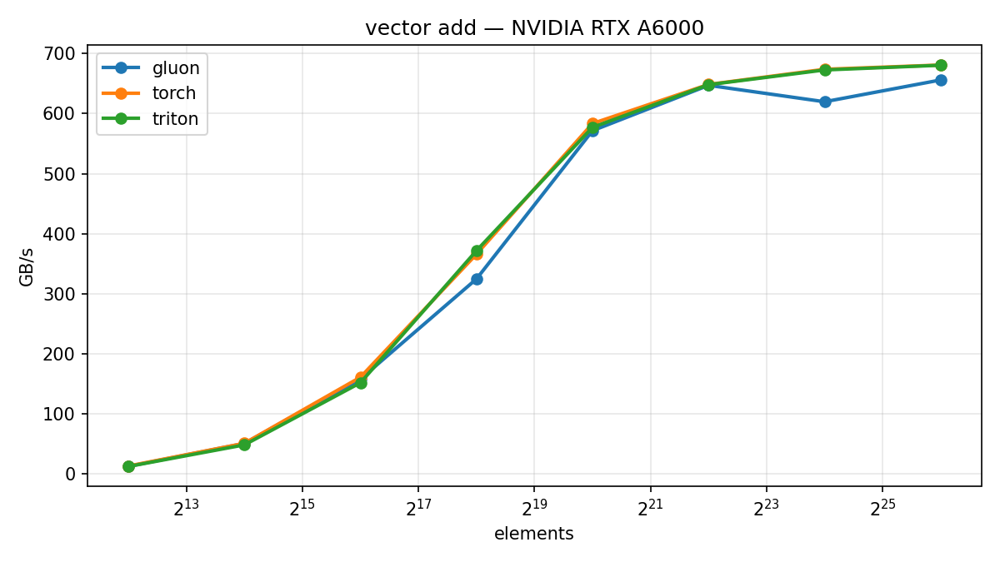

# Gluon by Example

**Learn [Triton](https://github.com/triton-lang/triton)'s Gluon, the new
low-level GPU kernel language, by writing the same kernels in Triton and
Gluon side by side, and benchmarking both.**

> Not MXNet Gluon. Not GluonHQ/JavaFX. This is about
> `triton.experimental.gluon`, the explicit-layout GPU language in the Triton
> compiler stack.



## Quickstart

```bash
git clone https://github.com/abhiksark/gluon-by-example
cd gluon-by-example
pip install -e ".[dev]"
pytest tests/ -v                          # correctness on your GPU
python chapters/01-vector-add/bench.py    # benchmark on your GPU
```

Requires: NVIDIA GPU (Ampere or newer), CUDA PyTorch, Triton ≥ 3.7.

## Chapters

| # | Kernel | Backends | Status |
|---|--------|----------|--------|
| [1](chapters/01-vector-add/) | vector add | Triton + Gluon | ✅ |
| [2](chapters/02-softmax/) | fused softmax | Triton | ✅ |
| [3](chapters/03-softmax-gluon/) | softmax | Gluon | ✅ |
| [4](chapters/04-matmul/) | matmul | Triton | ✅ |
| [5](chapters/05-matmul-gluon/) | matmul | Gluon (mma_v2) | ✅ |
| 6 | flash attention | Triton | planned |
| 7 | flash attention | Gluon (TMA + warp specialization) | planned |

## Which Gluon features run on which GPU?

Verified against the official Gluon tutorial gates (Triton main, 2026-06):

| Gluon feature | Requires | RTX 30/40-series, A6000 | RTX 5090 | H100 | B200 |
|---|---|---|---|---|---|
| Core: layouts, `cp.async`, `mma_v2` | CC ≥ 8.0 | ✅ | ✅ | ✅ | ✅ |
| TMA, warp specialization | CC major ≥ 9 | ❌ | ✅ | ✅ | ✅ |
| wgmma | CC major == 9 (Hopper only) | ❌ | ❌ | ✅ | ❌ |
| tcgen05 / tensor memory | CC major == 10 (sm_100) | ❌ | ❌ | ❌ | ✅ |

(Yes, wgmma is Hopper-*only* and tcgen05 is datacenter-Blackwell-only.
Consumer Blackwell has neither: it has TMA. This table took actual source
reading to assemble; that's why it's here.)

## Gluon resources

- [Official Gluon tutorials](https://github.com/triton-lang/triton/tree/main/python/tutorials/gluon)
- [Gluon docs](https://triton-lang.org/main/gluon/index.html)
- [Triton repo](https://github.com/triton-lang/triton)

## Layout

```
chapters/    one directory per chapter: explainer README + bench script
src/         installable package: gluon_by_example.{triton_impl,gluon_impl}
tests/       pytest, parametrized over backends, vs PyTorch references
benchmarks/  committed CSV results + charts, tagged by GPU
tools/       shared chart generator
```

*Gluon is experimental and its API moves fast. Each chapter records the
Triton version it was written against. Currently: 3.7.0.*
