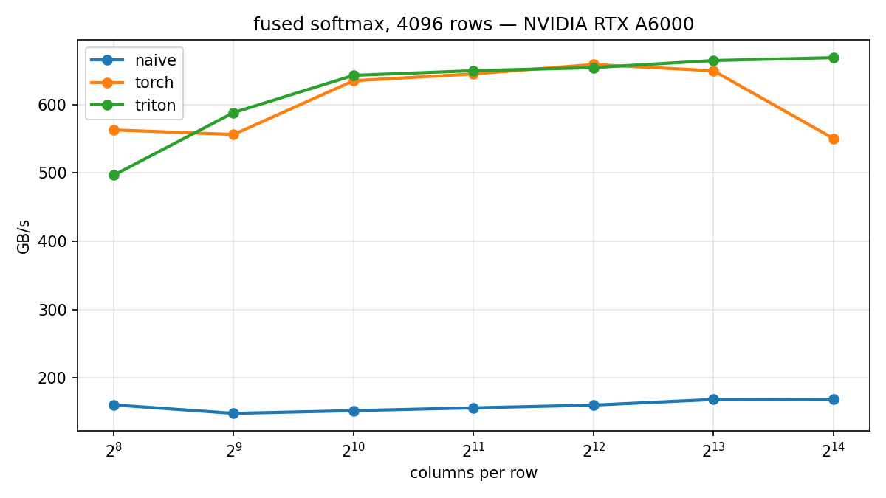

# Chapter 2: Fused Softmax — Why Fusion Is the Whole Game

Chapter 1 showed that for elementwise ops, a custom kernel buys nothing —
everyone saturates DRAM. Softmax is where custom kernels start paying rent,
and the reason is **fusion**, not clever math.

## The memory traffic argument

Row-wise softmax in eager PyTorch is five separate kernels:

```python
x_max = x.max(dim=-1, keepdim=True)[0]      # read MN, write M
z = x - x_max                               # read MN + M, write MN
numerator = torch.exp(z)                    # read MN, write MN
denominator = numerator.sum(dim=-1, ...)    # read MN, write M
out = numerator / denominator               # read MN + M, write MN
```

That's roughly **8 passes** over the matrix (5MN+2M reads, 3MN+2M writes,
for M rows × N cols). The math is trivial; the memory traffic is the cost.
A fused kernel reads the matrix **once** and writes it **once**: ~4x less
traffic, so ~4x faster on a bandwidth-bound GPU. No algorithmic insight
required — just not leaving the chip between steps.

## The kernel

[source](../../src/gluon_by_example/triton_impl/softmax.py)

One program per row. The row is loaded into registers whole
(`BLOCK = next_power_of_2(n_cols)`, masked at the edge), normalized
on-chip in fp32, written back once:

```python
x = tl.load(x_ptr + row * row_stride + cols, mask=mask, other=-float("inf"))
x = x.to(tl.float32)
x = x - tl.max(x, axis=0)   # numerical stability: softmax(x) == softmax(x - c)
numerator = tl.exp(x)
denominator = tl.sum(numerator, axis=0)
tl.store(out_ptr + row * row_stride + cols, numerator / denominator, mask=mask)
```

Three things worth noticing:

- `other=-float("inf")` makes the padding lanes vanish in both reductions:
  `max(x, -inf) = max(x)` and `exp(-inf) = 0`.
- `tl.max` / `tl.sum` are **reductions across the block** — the first
  Triton feature with no elementwise analogue. The compiler picks the
  shuffle/shared-memory strategy. (Remember that sentence when chapter 3
  makes us do it by hand in Gluon.)
- Each program holds its whole row in registers, which caps the row width
  (we gate at 32768 columns). The official Triton tutorial's
  [persistent variant](https://github.com/triton-lang/triton/blob/main/python/tutorials/02-fused-softmax.py)
  adds occupancy-aware scheduling on top; we keep the simple version —
  it stays readable and, on this hardware, it already matches `torch.softmax`.

## Benchmark



All providers are charged the same ideal traffic (read MN + write MN), so
the y-axis is *effective* bandwidth. On the RTX A6000, the naive line sits
flat around 150–170 GB/s while the fused kernels reach 650+ — almost exactly
the ~4x the traffic math predicts. `torch.softmax` is itself a fused CUDA
kernel, which is why beating it takes more than fusion; matching it with 30
lines of Python is the point (and at N=16384 the Triton kernel holds
669 GB/s while torch dips to 551).

## Run it

```bash
pytest tests/test_softmax.py -v        # correctness
python chapters/02-softmax/bench.py    # regenerate CSV + chart
```

Next: chapter 3 writes this same kernel in Gluon, where the layout and the
reduction strategy stop being the compiler's decision and become yours.

*Written against Triton 3.7.0 (pip). Gluon is experimental; APIs move.*
