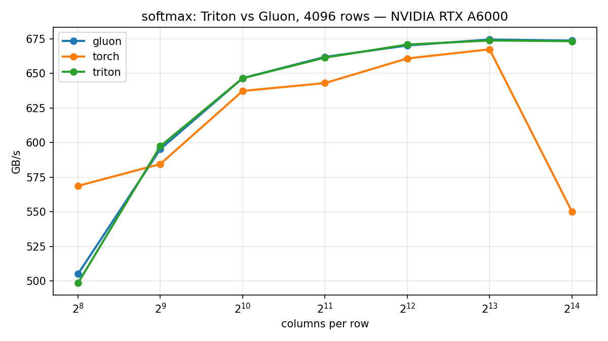

# Chapter 3: Softmax in Gluon: Owning the Layout

[Chapter 2](../02-softmax/) let the compiler pick the tensor layout and lower
the reductions. This chapter writes the **same fused-row softmax** in Gluon,
where the layout is yours, and the first layout we picked cost us 11%.

Sources:
[Triton twin](../../src/gluon_by_example/triton_impl/softmax.py) ·
[Gluon kernel](../../src/gluon_by_example/gluon_impl/softmax.py)

---

## The two deltas

### Delta 1: the layout

The Triton wrapper has no layout code:

```python
@triton.jit
def _softmax_kernel(x_ptr, out_ptr, row_stride, n_cols, BLOCK: tl.constexpr):
    row = tl.program_id(0)
    cols = tl.arange(0, BLOCK)
```

The Gluon wrapper builds a `BlockedLayout` host-side and passes it as a
constexpr. Here is the final committed wrapper code (num_warps ladder included
so the formula's inputs are visible):

```python
    num_warps = 4
    if block >= 2048:
        num_warps = 8
    if block >= 8192:
        num_warps = 16
    size_per_thread = max(min(block // (32 * num_warps), 16 // x.element_size()), 1)
    layout = gl.BlockedLayout(
        size_per_thread=[size_per_thread],
        threads_per_warp=[32],
        warps_per_cta=[num_warps],
        order=[0],
    )
    _softmax_kernel[(n_rows,)](
        x, out, x.stride(0), n_cols, BLOCK=block, layout=layout, num_warps=num_warps
    )
```

The kernel signature accepts the layout as a constexpr:

```python
@gluon.jit
def _softmax_kernel(x_ptr, out_ptr, row_stride, n_cols,
                    BLOCK: gl.constexpr, layout: gl.constexpr):
    row = gl.program_id(0)
    cols = gl.arange(0, BLOCK, layout=layout)
```

Triton's inferred layout comes from dtype width and alignment (`[4]` elements
for fp32 (aligned), `[8]` for fp16, `[1]` for unaligned rows) and then tiles.
Our formula divides `BLOCK` evenly across `32 × num_warps` lanes; the 16-byte
cap (explained in the next section) is exactly what brings it in line with
Triton's inference.

For rows narrower than `32 × num_warps` lanes the layout is larger than the
tensor, and Gluon replicates elements across the extra lanes (the `(16, 64)`
test shape pins this).

### Delta 2: the reductions

Triton uses built-in ops:

```python
    x = x - tl.max(x, axis=0)
    numerator = tl.exp(x)
    denominator = tl.sum(numerator, axis=0)
```

Gluon uses `gl.reduce` with explicit combine functions:

```python
    x = x - gl.reduce(x, axis=0, combine_fn=_max_fn)
    numerator = gl.exp(x)
    denominator = gl.reduce(numerator, axis=0, combine_fn=_add_fn)
```

where the combine functions are:

```python
@gluon.jit
def _max_fn(a, b):
    return gl.maximum(a, b)

@gluon.jit
def _add_fn(a, b):
    return a + b
```

`gl.max` / `gl.sum` sugar exists; we spelled out `reduce` + `combine_fn` to
show what a reduction is made of.

Chapter 2 said: *"The compiler picks the shuffle/shared-memory strategy;
remember that sentence."* Here's the twist: `gl.reduce` **still** picks the
cross-warp strategy. We expected to manage shared memory by hand for the
cross-warp stage; in practice, `gl.reduce` lowers that internally. What you
own at this rung is the combine function and (the part that bit us) the
layout the reduction operates on. The shared-memory lesson waits for matmul.

---

## Our first layout lost 11%

The obvious formula is `size_per_thread = block // (32 * num_warps)`. It
divides the row evenly across lanes, gives each thread a contiguous run, and
covers `BLOCK` exactly in one pass. It works fine at moderate row widths. At
`N=16384` with 16 warps, each lane's run is `16384 / (32 × 16) = 32` fp32
elements = **128 bytes**.

Measured on the RTX A6000, fp32, 5 trials (spread <0.2%):

| kernel | GB/s |
|---|---|
| gluon (uncapped, 128B/lane) | ~599 |
| triton | ~673 |

That is a reproducible 11% gap, not noise.

**Why.** A warp's 32 lanes issue their loads together. When each lane's address
is 128 bytes from its neighbor's, one warp access touches 32 different cache
lines instead of a handful. Coalescing collapses; the L2 sees 32 transactions
per load where it should see one or two.

**Fix sweep** (measured on RTX A6000, fp32):

| run cap | GB/s |
|---|---|
| 32 elems (128B), uncapped | ~599 |
| 8 elems (32B) | ~663 |
| 4 elems (16B), fp32 parity | ~673 |

Capping each lane's run at 4 fp32 elements (= 16 bytes) restores parity. For
fp16 the same 16-byte cap is 8 elements. The formula:

```python
size_per_thread = max(min(block // (32 * num_warps), 16 // x.element_size()), 1)
```

This is exactly the dtype-width logic Triton's layout inference applies.

**The lesson:** owning the layout means owning its failure modes; the
compiler's defaults encode real hardware knowledge, and Gluon makes you
re-learn it on purpose.

---

## Benchmark



Fresh results, RTX A6000, fp32, M=4096 rows:

| N | torch (GB/s) | triton (GB/s) | gluon (GB/s) |
|---|---|---|---|
| 256 | 568.7 | 498.5 | 505.1 |
| 512 | 584.5 | 597.4 | 595.3 |
| 1024 | 637.3 | 646.5 | 646.6 |
| 2048 | 643.0 | 661.4 | 662.0 |
| 4096 | 660.8 | 670.9 | 670.2 |
| 8192 | 667.4 | 673.8 | 674.6 |
| 16384 | 550.2 | 673.3 | 673.7 |

Parity across all widths: that is the honest outcome at this rung. Explicit
layout control matches the compiler here; at N=16384, gluon 673.7 vs triton
673.3 GB/s. The payoff is not throughput; it is the layout instinct itself.
Layouts and the feel for when they go wrong are exactly what chapters 5 and 7
need: `cp.async` and TMA stop being something Triton's pipeliner schedules for
you and become something you orchestrate. (Triton's pipeliner does emit
`cp.async`, and Triton exposes TMA via descriptors; the claim is about
control, not capability.)

**On run variance:** mid-size points swing a few percent between runs. Compare
this CSV with chapter 2's committed `softmax-nvidia-rtx-a6000.csv`: triton@4096
was 654 GB/s in chapter 2's run, 670.9 GB/s in this one. Neither the code nor
the GPU changed. Single mid-size points are weather; a reproducible endpoint
gap like the 11% we measured with uncapped lanes is climate.

---

## Gotchas we hit

- **Combine functions must be `@gluon.jit`.** Passing a plain Python callable
  to `gl.reduce` fails at compile time; the combine function is lowered into
  the kernel body.

- **Layouts are compile-time constants.** The layout is computed host-side and
  passed as a `gl.constexpr` argument. You can also build a layout inside the
  kernel body with a `: gl.constexpr` annotation, but it cannot depend on a
  runtime value; the constraint is compile-time, not location.

- **`gl.reduce` on a 1-D tensor returns a scalar that broadcasts.** `keep_dims`
  exists in the signature but raises on 1-D input in Triton 3.7.0. You do not
  need it; `x - gl.reduce(x, ...)` broadcasts automatically.

- **Narrow rows: replication, not truncation.** For rows narrower than
  `32 × num_warps` lanes the layout is larger than the tensor; Gluon
  replicates elements across the extra lanes. The test suite covers the `(16,
  64)` shape exactly to pin this behavior.

---

## Run it

```bash
pytest tests/test_softmax.py -q
python chapters/03-softmax-gluon/bench.py
```

Next: chapter 4 returns to Triton for matmul (tiling and autotune) before chapter 5 hands the whole pipeline (cp.async, mma) to Gluon.

*Written against Triton 3.7.0 (pip). Gluon is experimental; APIs move.*
