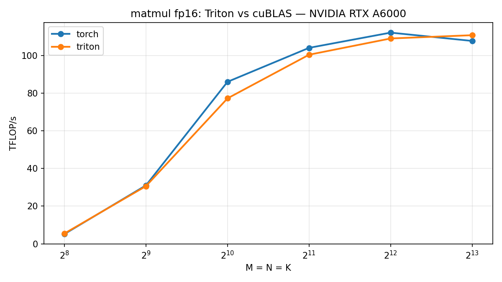

# Chapter 4: Matmul in Triton: Tiling and Autotune

Chapters 1-3 were bandwidth-bound and hand-launched; we picked the block size
and the warp count ourselves. Matmul is the first **compute-bound** kernel, and
the first where autotuning earns its keep: the right tile shape is not obvious,
so we let the machine find it.

Sources:
[Triton kernel](../../src/gluon_by_example/triton_impl/matmul.py) ·
[tests](../../tests/test_matmul.py)

---

## Three ideas

### Tiling and the K-loop

A matmul tile owns a `BLOCK_M × BLOCK_N` patch of `C`. To fill it we sweep the
shared `K` dimension in `BLOCK_K` chunks, multiplying-and-adding as we go. The
accumulator lives in fp32 for the whole sweep:

```python
acc = tl.zeros((BLOCK_M, BLOCK_N), dtype=tl.float32)
for k in range(0, tl.cdiv(K, BLOCK_K)):
    a = tl.load(a_ptrs, mask=offs_k[None, :] < K - k * BLOCK_K, other=0.0)
    b = tl.load(b_ptrs, mask=offs_k[:, None] < K - k * BLOCK_K, other=0.0)
    acc = tl.dot(a, b, acc)
    a_ptrs += BLOCK_K * stride_ak
    b_ptrs += BLOCK_K * stride_bk
```

The inputs are fp16/bf16 (that is what feeds the tensor cores), but every
partial product lands in fp32. Summing thousands of low-precision products in
low precision would bleed bits on every add. Accumulating in fp32 keeps the
running sum honest; we downcast exactly once, after the loop closes:

```python
# Accumulate in fp32, downcast once at the end.
c = acc.to(c_ptr.dtype.element_ty)
```

One downcast, at the end, not per chunk.

### Grouped, L2-friendly program ordering

A naive row-major walk of `C` would have each program load fresh A rows and B
columns. The grouped scheme instead walks `C` in tall super-rows so that
programs running near each other in time reuse the same operands out of L2:

```python
# Grouped ordering: walk C in GROUP_M-tall column-major super-rows so
# neighboring programs reuse the same A rows and B columns through L2.
num_pid_in_group = GROUP_M * num_pid_n
group_id = pid // num_pid_in_group
first_pid_m = group_id * GROUP_M
group_size_m = min(num_pid_m - first_pid_m, GROUP_M)
pid_m = first_pid_m + ((pid % num_pid_in_group) % group_size_m)
pid_n = (pid % num_pid_in_group) // group_size_m
```

Same arithmetic, same result; only the *order* in which tiles are computed
changes. But order is what decides whether a B column is still warm in L2 when
the next program asks for it. With `GROUP_M = 8`, eight neighboring `pid_m`
rows share each B column before it ages out.

### Autotuning

The block sizes above are constexprs, and the best values depend on the GPU and
on `(M, N, K)`. Rather than guess, we hand the autotuner a small search space:

```python
@triton.autotune(configs=_CONFIGS, key=["M", "N", "K"])
@triton.jit
def _matmul_kernel(a_ptr, b_ptr, c_ptr, M, N, K, ...):
```

On the first call for a given `(M, N, K)`, Triton runs every config in
`_CONFIGS`, times them, and caches the winner; subsequent calls with the same
key skip straight to it. The search cost is paid once.

The list is also written to degrade gracefully on smaller cards. From the
kernel comment:

```python
# The first config sits at 96KB of the 99KB CC 8.6 shared memory budget
# (the pipeliner buffers num_stages - 1 tiles); on cards with less shared
# memory the autotuner silently scores failing configs as inf and skips
# them, so the list degrades gracefully rather than crashing.
```

The biggest config rides right up to the A6000's shared-memory ceiling. A card
with a smaller budget cannot launch it, but a config that fails to launch is
scored as `inf` and dropped from the race, so the autotuner simply picks the
best one that *does* fit. The list never has to be GPU-specific.

---

## A note on correctness

The tests do not check against cuBLAS. They check against the **fp64 product**
of the same inputs, the mathematically true answer:

```python
torch.testing.assert_close(out.double(), a.double() @ b.double(), **TOLS[dtype])
```

The reasoning, paraphrased from the test file: cuBLAS is itself ~1-2
output-ulps from the true answer (on bf16, farther from truth than this
kernel), so it is too noisy to serve as a reference. Comparing one approximate
matmul against another tells you they disagree, not which one is right. The
fp64 product is the fixed point both are approximating, so that is what we
measure against. With fp32 accumulation and a single downcast, the kernel stays
within ~1 output ulp; on the A6000 the worst observed error-to-tolerance ratio
was 0.24.

---

## Benchmark



Measured on the RTX A6000, fp16, square `N × N` matmuls:

| N | torch (TFLOP/s) | triton (TFLOP/s) |
|---|---|---|
| 256 | 5.16 | 5.46 |
| 512 | 31.0 | 30.6 |
| 1024 | 85.96 | 77.18 |
| 2048 | 103.99 | 100.34 |
| 4096 | 112.06 | 108.96 |
| 8192 | 107.65 | 110.7 |

The honest verdict: cuBLAS is the better-rounded library across the mid-sizes
(at 1024 it leads 85.96 to 77.18), but the gap closes as the problem grows, and
at the largest size the autotuned kernel pulls ahead: at `N=8192`, Triton hits
110.7 TFLOP/s against cuBLAS's 107.65. A few hundred lines of tiling and a
six-config search match a vendor library where it matters most: on the big
tiles.

---

## Run it

```bash
pytest tests/test_matmul.py -q
python chapters/04-matmul/bench.py
```

Next: chapter 5 hands the same matmul to Gluon (explicit layouts and mma_v2) and an honest look at whether hand control beats the compiler.

*Written against Triton 3.7.0 (pip). Gluon is experimental; APIs move.*
