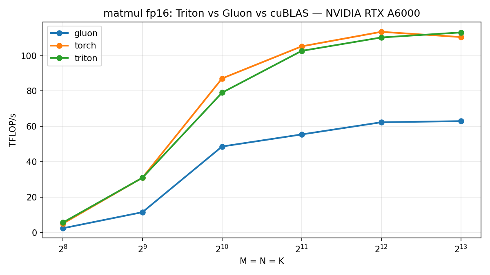

# Chapter 5: Matmul in Gluon — When Hand Control Loses to the Compiler

[Chapter 4](../04-matmul/) let Triton tile, group, and autotune the fp16
matmul. Here we hand-build the same matmul in Gluon — explicit MMA layouts and
`mma_v2` — and measure whether owning the pipeline beats the compiler.

It doesn't. The chapter is the chase: three attempts to close the gap, each one
peeling off a layer, until we hit a wall we can name down to the SASS.

Sources:
[Triton twin](../../src/gluon_by_example/triton_impl/matmul.py) ·
[Gluon floor](../../src/gluon_by_example/gluon_impl/matmul.py) ·
[Gluon pipelined](../../src/gluon_by_example/gluon_impl/matmul_pipelined.py)

---

## The new machinery (vs chapter 3)

Chapter 3's softmax had reductions but no tensor-core MMA — `gl.reduce` and a
single `BlockedLayout` were the whole layout story. Matmul adds the part that
chapter said was still waiting: the MMA itself. Two new things show up here —
three coordinated MMA layouts and `mma_v2`.

The layouts are built host-side and passed in as constexprs:

```python
    acc_layout = gl.NVMMADistributedLayout(
        version=[2, 0], warps_per_cta=[_NUM_WARPS, 1], instr_shape=[16, 8])
    lhs_layout = gl.DotOperandLayout(parent=acc_layout, operand_index=0, k_width=8)
    rhs_layout = gl.DotOperandLayout(parent=acc_layout, operand_index=1, k_width=8)
    load_layout = gl.BlockedLayout([1, 8], [4, 8], [_NUM_WARPS, 1], [1, 0])
```

`NVMMADistributedLayout` is the shape the tensor-core instruction leaves its
**fp32 accumulator** in — `instr_shape=[16, 8]` is the Ampere MMA tile. The two
`DotOperandLayout`s are the shapes the instruction wants its **A and B operands**
in: same parent (coordinated with the accumulator), `operand_index` 0 vs 1
picking left vs right, `k_width=8` packing eight fp16 along the contraction
dimension per lane. The `BlockedLayout` is the plain coalesced-load layout. The
floor kernel's K-loop moves between them, with no pipeline:

```python
    acc = gl.full([BLOCK_M, BLOCK_N], 0.0, gl.float32, acc_layout)
    for k0 in range(0, K, BLOCK_K):
        a_tile = gl.load(a_ptr + offs_m[:, None] * K + offs_ka[None, :])
        b_tile = gl.load(b_ptr + offs_kb[:, None] * N + offs_n[None, :])
        acc = mma_v2(gl.convert_layout(a_tile, lhs_layout),
                     gl.convert_layout(b_tile, rhs_layout),
                     acc)
    out = gl.convert_layout(acc.to(gl.float16), load_layout)
```

Accumulation stays in fp32 across the K-loop and downcasts to fp16 once on the
way out — identical numerics to the Triton twin. The arithmetic is the same as
chapter 4. Only the scheduling differs, and scheduling is the whole chapter.

---

## The narrow contract, stated honestly

Both Gluon kernels take fp16, tile-aligned inputs only — M and N divisible by
128 (K by 64 for the floor, 32 for the pipelined version) — and do **no
masking**. That is narrower than the Triton twin on purpose: the Triton matmul
masks, autotunes its tile, and handles bf16 — it is the production gemm. These
chapters are about the mechanics and the verdict, so the contract is kept tight
enough that the mechanics are the only thing on screen. Unaligned shapes raise
`ValueError` before launch (`test_gluon_rejects_unaligned`).

---

## Act I — the floor loses, and the surprise behind it

The floor runs at about **0.55–0.63× of Triton** across the large sizes. The
obvious explanation — the one I believed first — is that it *stalls*: load a
tile, wait on global memory, run the MMA, repeat, tensor cores idle through every
load.

**That explanation is wrong, and proving it wrong drives the rest of the chapter.**

The tell: the floor uses almost no shared memory (just scratch for
`convert_layout`), so it runs roughly **6 thread-blocks per SM**. With that many
blocks resident, Ampere's warp scheduler already hides the load latency — while
one block waits on a `gl.load`, it runs warps from another. The latency is
covered *for free, by occupancy*. So "idle MMA during loads" is not the gap. We
can prove it: build the pipeline that's supposed to fix the stall and watch it
fail.

## Act II — the cp.async pipeline

The textbook fix is a `cp.async` software pipeline: a shared-memory ring buffer
that prefetches the next K-tiles while the MMA works on the current one.
`cp.async` exists on Ampere, so it's buildable in Gluon —
[the pipelined kernel](../../src/gluon_by_example/gluon_impl/matmul_pipelined.py).

**First attempt: it backfired.** Built at the floor's `BLOCK_K=64` with a 3-stage
ring, it needs ~96 KB of shared memory — collapsing occupancy from ~6 blocks/SM
to **1**. It ran at ~**0.73× of the floor** — *slower* — even though the overlap
worked. The ring's shared memory evicted the co-resident blocks that were hiding
the latency. (Reproduce: set `_BLOCK_K = 64`.) Occupancy, not pipeline logic, was
the binding resource.

**The fix: match the compiler's footprint.** Triton's autotuner picks
`BLOCK_K=32` (3 buffered tiles = 48 KB → 2 blocks/SM). Shrink `BLOCK_K` to 32 and
the ring fits at 2 blocks/SM — and the pipeline beats the floor at moderate N.
But ungrouped, it still **dips below the floor at 8192**: the plain column-major
tile walk thrashes L2 once the matrices outgrow it, and prefetching just hammers
DRAM harder.

## Act III — GROUP_M, the L2-aware tile order

The 8192 dip is a tile-*ordering* problem, not a pipeline problem. The Triton
twin walks output tiles in `GROUP_M`-tall super-rows so neighbors reuse A/B
through L2 (chapter 4); the hand kernel used a plain 2-D grid with none of that.
Adding the same grouped raster (a 1-D grid + the super-row index math) is pure
L2 reuse — same footprint, same occupancy:

```python
    pid = gl.program_id(0)
    num_pid_in_group = GROUP_M * num_pid_n
    group_id = pid // num_pid_in_group
    first_pid_m = group_id * GROUP_M
    group_size_m = min(num_pid_m - first_pid_m, GROUP_M)
    pid_m = first_pid_m + ((pid % num_pid_in_group) % group_size_m)
    pid_n = (pid % num_pid_in_group) // group_size_m
```

This is the win. The pipeline now **beats the floor at every large size**, and at
8192 it jumps from below-the-floor to **83.4 TFLOP/s (1.35× the floor, 0.76× of
Triton)** — closing about half the remaining gap. GROUP_M only matters at large N
(at 1024 the matrices still fit L2, so it's a wash); that N-dependence is the
fingerprint of an L2 effect.

This — cp.async pipeline + footprint match + GROUP_M ordering — is the hand
ceiling: **~0.7–0.76× of Triton.**

## The wall — and why it's the compiler's, not ours

Past here, every further lever **regressed**. `STAGES=4` (deeper ring) dropped to
~0.62×; matching Triton's exact wide-N tile (128×256, 8 warps) dropped to ~0.58×;
hand register-double-buffering (load tile k+1's operands while MMA-ing tile k)
ran ~15% *slower* — it raised register pressure into spills and the scheduler
shoved the loads to the loop tail. The config knobs are exhausted.

So we read the SASS. At N=4096 both kernels emit the **same** 64 `HMMA` and 16
`LDSM` — the ring was never the issue. The difference is the operand path:

- **Triton hoists all 16 `LDSM` to the top of the loop**, then a dense `HMMA`
  stream with **zero register copies**.
- **The hand kernel interleaves 52 `IMAD.MOV` register shuffles** through the MMA
  stream — `smem.load()` lands operands in registers the `HMMA` can't directly
  consume, so ptxas inserts copies to align them, serializing the loads onto the
  MMA's critical path.

Nsight Compute confirms the cost: **tensor-pipe active 76.6% (Triton) vs 56.3%
(hand)**, and a **short-scoreboard stall of 0.02 vs 3.60** — the hand kernel
blocks on shared-memory loads 180× more. Same occupancy; this is purely
instruction scheduling.

The root cause is structural: Triton runs a **software-pipeliner compiler pass**
that rewrites `local_load → dot` into hoisted `ldmatrix` plus a register-aligned
MMA stream — choosing the load destination registers *to match* the MMA's input
registers. **Gluon's `@gluon.jit` path does not run that pass.** You express the
cp.async ring by hand, but the register assignment is left to ptxas, which can't
match it. And there is no Gluon API to get it back: `gl` has no
`range(num_stages=…)` auto-pipeliner (only `static_range`), and `warp_specialize`
is [Hopper-and-newer only](https://triton-lang.org/main/gluon/index.html). Closing
the last ~25% would mean dropping to raw PTX to pin registers.

**That is the chapter.** Gluon gives you explicit control of *layouts, shared
memory, and async copies* — and with all three, hand control climbs from 0.55× to
0.76× of the compiler. The last 25% lives in *register allocation and instruction
scheduling*, which Gluon hands to the backend. On a compute-bound Ampere GEMM,
that is where the compiler wins, and no amount of Gluon-level tuning reaches it.

---

## Benchmark



Measured on the RTX A6000, fp16, square N×N, TFLOP/s:

| N | torch (cuBLAS) | triton | gluon (floor) | gluon-pipe |
|---|---|---|---|---|
| 256 | 5.10 | 5.51 | 2.17 | 2.33 |
| 512 | 29.92 | 29.92 | 11.37 | 11.06 |
| 1024 | 81.82 | 77.84 | 48.68 | 44.49 |
| 2048 | 101.63 | 96.25 | 55.14 | 73.27 |
| 4096 | 111.04 | 110.05 | 60.83 | 74.41 |
| 8192 | 103.91 | 109.66 | 61.97 | 83.43 |

The climate: `gluon-pipe` beats the floor at every size ≥ 2048 (1.2–1.35×) and
reaches ~0.76× of Triton at 8192; the floor sits at ~0.55–0.63×. Single mid-size
points are weather — `triton` at N=2048 reads 96.2 here and ~102 in other runs;
neither the code nor the card changed. The reproducible signals are the three the
chapter rests on: the floor's ~0.55× deficit, GROUP_M lifting 8192 above the
floor, and the ~0.75× hand ceiling.

---

## Gotchas we hit

- **Footprint is the binding resource, not pipeline logic.** A deeper or
  bigger-tile `cp.async` ring can run *slower* than no pipeline, because the
  shared memory it needs evicts the co-resident blocks that hide latency through
  occupancy. The whole Act-II backfire is this lesson.
- **L2 tile ordering is N-dependent.** GROUP_M does nothing at small N (the data
  fits L2) and is decisive at large N. If a kernel's gap *widens* with size,
  suspect tile-visit order before pipeline depth.
- **`NVMMASharedLayout` swizzle width is capped by the inner contiguous dim.** At
  `BLOCK_K=32` the A tile takes a 64 B swizzle (B keeps 128 B). The plain
  swizzled layout cost ~50% to smem bank conflicts.
- **No auto-pipeliner, and warp specialization is Hopper-only.** `gl` has only
  `static_range`, not a `num_stages` loop; `warp_specialize` needs CC ≥ 9. On
  Ampere the cp.async ring is the only latency-hiding lever Gluon exposes.
- **Tile-aligned fp16 only.** Both kernels raise on unaligned or bf16 inputs
  (`test_gluon_rejects_unaligned`, `test_gluon_rejects_bf16`).

---

## Run it

```bash
pytest tests/test_matmul.py -q
python chapters/05-matmul-gluon/bench.py
```

Next: chapter 6 returns to Triton for flash attention — the kernel with real data reuse, where explicit control finally gets a fair fight.

*Written against Triton 3.7.0 (pip). Gluon is experimental; APIs move.*
